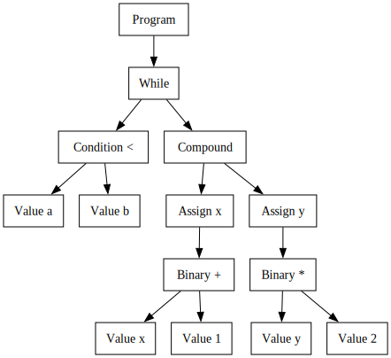
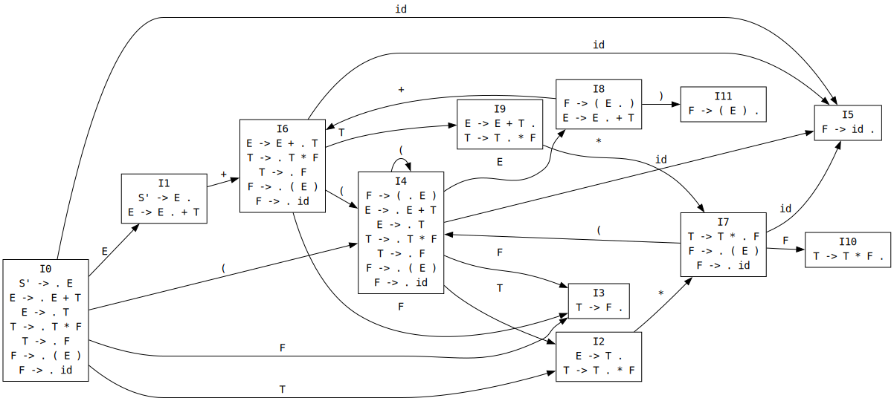

# 编译原理实验报告

## 1. 实验基本信息

| 项目 | 内容 |
| --- | --- |
| 课程 | 编译原理 |
| 实验一 | 词法分析程序的设计与实现 |
| 实验二/三 | 语法制导的三地址代码生成 |
| 实现语言 | Java |
| 自动生成工具 | GNU Bison，Java parser 输出 |
| 可执行程序 | `dist/compiler-lab.jar` |
| 构建命令 | `make build`、`make dist` |
| 测试命令 | `make test` |
| 最近验证 | 2026-05-29，`make test` 通过 |

## 2. 实验任务分工

本组按照实验亦前端处理流程分工。三位成员均参与总体设计与联调，具体分工如下。

| 成员 | 学号 | 主要分工 | 主要技术内容 |
| --- | --- | --- | --- |
| 郑天白 | 23070202 | 词法分析子系统 | 输入处理、Token 识别、正规式、正规文法、状态图、词法测试 |
| 段晰迈 | 23070201 | 递归下降语法分析子系统 | 消除左递归、递归下降子程序、语法图、语法树输出、错误处理扩展 |
| 高子涵 | 23070207 | Bison 语法分析与三地址代码生成 | Bison 文法、AST、TAC 生成、错误恢复、扩展功能、测试、可执行程序 |

最终报告按编译器前端流程统一组织，将词法分析、递归下降语法分析、Bison 语法分析、MiniYacc/SLR 原理展示和三地址代码生成放入同一条技术主线中说明。Lab 1 与 Lab 2 已完成的正规式、正规文法、语法图、测试用例和扩展说明在对应子系统中直接呈现，并按当前实现口径补充必要说明。

## 3. 实验要求完成情况

| 实验要求 | 完成情况 | 证据 |
| --- | --- | --- |
| 词法分析器识别三种整数、标识符、主要运算符和关键字 | 已完成 | `examples/lab1/handout.*`、`tests/lab1_sample.*` |
| 给出词法正规式、正规文法、状态图、主要数据结构与算法 | 已完成 | 本报告第 4 节 |
| 语法分析程序输出语法树或最左派生产生式序列 | 已完成 | `examples/lab2/tree-sample.*`、`tests/lab2_tree_sample.*` |
| 源程序包含多个语句 | 已完成 | 标准 Lab 2/Lab 3 样例均包含多语句 |
| 对源程序错误做适当处理 | 已完成 | `tests/lab2_tree_invalid_octal.*`、`tests/lab3_tac_error_*` |
| 根据语法制导定义生成三地址代码 | 已完成 | `examples/lab3/handout-tac.*`、`tests/lab3_tac_sample.*` |
| 采用自动生成技术时说明工具、描述程序和辅助程序 | 已完成 | 第 5.2 节 Bison 语法分析 |
| 扩展功能 | 已完成 | 关系运算、复合语句、错误恢复、AST 展示、常量折叠、MiniYacc/SLR 展示 |
| 可执行程序 | 已完成 | `make dist` 生成 `dist/compiler-lab.jar` |

## 4. 词法分析子系统

### 4.1 子系统任务

词法分析子系统负责从标准输入读取源程序，将字符序列转换为具有种别值和属性值的 Token。实验要求识别：

1. 标识符；
2. 十进制整数；
3. 八进制整数；
4. 十六进制整数；
5. 主要运算符和分隔符；
6. 关键字；
7. 非法八进制整数；
8. 非法十六进制整数。

本组词法分析程序采用手工实现方式，没有使用 Lex/Flex。程序先读取完整标准输入，再逐个扫描 token。当前项目中 `src/Lexer.java` 与 `src/Token.java` 是 Lab 1、Lab 2、Lab 3 共用的词法实现。

### 4.2 字符集与正规式

字符集定义：

```text
letter             = A|B|...|Z|a|b|...|z
digit              = 0|1|2|3|4|5|6|7|8|9
nonzero_digit      = 1|2|3|4|5|6|7|8|9
oct_digit          = 0|1|2|3|4|5|6|7
hex_digit          = digit|a|b|c|d|e|f|A|B|C|D|E|F
illegal_hex_letter = g|h|...|z|G|H|...|Z
underline          = _
id_start           = letter|underline
id_char            = letter|digit|underline
```

指导书中标识符正规式为：

```text
IDN = letter(letter|digit)*
```

实现中扩展支持下划线，因此实际标识符正规式为：

```text
IDN = (letter|_)(letter|digit|_)*
```

整数正规式：

```text
DEC   = 0 | nonzero_digit digit*
OCT   = 0 oct_digit+
HEX   = 0(x|X)hex_digit+
ILOCT = 0 digit* (8|9) digit*
ILHEX = 0(x|X)(digit|letter)* illegal_hex_letter (digit|letter)*
```

关键字正规式：

```text
KEYWORD = if|then|else|while|do|begin|end
```

运算符和分隔符正规式：

```text
OP        = +|-|*|/|>|<|=|>=|<=|<>
DELIMITER = (|)|;
```

### 4.3 单词种别设置

| 单词 | 种别值 | 属性值 |
| --- | --- | --- |
| 标识符 | `IDN` | 字符串 |
| 十进制整数 | `DEC` | 数值 |
| 八进制整数 | `OCT` | 数值 |
| 十六进制整数 | `HEX` | 数值 |
| `+` | `ADD` | `-` |
| `-` | `SUB` | `-` |
| `*` | `MUL` | `-` |
| `/` | `DIV` | `-` |
| `>` | `GT` | `-` |
| `<` | `LT` | `-` |
| `=` | `EQ` | `-` |
| `>=` | `GE` | `-` |
| `<=` | `LE` | `-` |
| `<>` | `NEQ` | `-` |
| `(` | `SLP` | `-` |
| `)` | `SRP` | `-` |
| `;` | `SEMI` | `-` |
| `if` | `IF` | `-` |
| `then` | `THEN` | `-` |
| `else` | `ELSE` | `-` |
| `while` | `WHILE` | `-` |
| `do` | `DO` | `-` |
| `begin` | `BEGIN` | `-` |
| `end` | `END` | `-` |
| 非法八进制数 | `ILOCT` | `-` |
| 非法十六进制数 | `ILHEX` | `-` |
| 其他非法数字 | `ILNUM` | `-` |
| 无法识别词素 | `UNKNOWN` | 原词素 |

### 4.4 变换后的正规文法

标识符和关键字：

```text
S -> letter A | _ A
A -> letter A | digit A | _ A | ε
```

识别到字符串后再判断是否属于关键字表。如果属于 `if`、`then`、`else`、`while`、`do`、`begin`、`end`，则输出关键字种别；否则输出 `IDN`。

十进制整数：

```text
S -> 0 | nonzero_digit B
B -> digit B | ε
```

八进制整数：

```text
S -> 0 C
C -> oct_digit D
D -> oct_digit D | ε
```

非法八进制整数：

```text
S -> 0 E
E -> oct_digit E | 8 F | 9 F
F -> digit F | ε
```

十六进制整数：

```text
S -> 0 H
H -> x I | X I
I -> hex_digit J
J -> hex_digit J | ε
```

非法十六进制整数：

```text
S -> 0 H
H -> x K | X K
K -> hex_digit K | illegal_hex_letter L | ε
L -> digit L | letter L | ε
```

其中 `K -> ε` 覆盖 `0x` 或 `0X` 后没有任何十六进制数字的非法情况。

运算符和分隔符：

```text
S -> + | - | * | / | = | ( | ) | ;
S -> > M
M -> = | ε
S -> < N
N -> = | > | ε
```

### 4.5 状态图

词法分析状态图如下。


从代码实现角度看，`Lexer.nextToken()` 的状态转换可以概括为：

```text
start
  -> skipWhitespace
  -> relational operator branch
  -> single-character token branch
  -> collect lexeme
  -> keyword / identifier / number / unknown classification
```

### 4.6 主要数据结构与函数

`Token` 是词法分析输出的基本单位：

```text
type   : token 种别值，如 IDN、DEC、WHILE
value  : 语义属性值，如标识符名、整数十进制值
lexeme : 原始词素，用于错误信息和非法 token 展示
line   : token 起始行
column : token 起始列
```

`Lexer` 保存输入状态：

```text
input  : 完整输入字符串
pos    : 当前扫描位置
length : 输入长度
line   : 当前行号
column : 当前列号
```

关键函数：

| 函数 | 作用 |
| --- | --- |
| `Lexer.nextToken()` | 词法分析主函数，每次返回一个 token |
| `skipWhitespace()` | 跳过空格、制表符、换行符 |
| `singleCharacterToken()` | 识别单字符运算符和分隔符 |
| `classifyLexeme()` | 将完整词素分类为关键字、标识符、数字或未知 |
| `classifyNumber()` | 区分 `DEC`、`OCT`、`HEX`、`ILOCT`、`ILHEX`、`ILNUM` |
| `convertBaseToDecimal()` | 将八进制/十六进制属性值转换为十进制字符串 |
| `advancePos()` | 推进位置并维护行列号 |

### 4.7 词法分析算法

`Lexer.nextToken()` 的算法流程：

```text
1. 调用 skipWhitespace() 跳过空白符。
2. 如果输入结束，返回 null。
3. 记录当前 token 起始行列号。
4. 若当前字符为 >：
     若下一个字符为 =，返回 GE；
     否则返回 GT。
5. 若当前字符为 <：
     若下一个字符为 =，返回 LE；
     若下一个字符为 >，返回 NEQ；
     否则返回 LT。
6. 尝试识别单字符运算符和分隔符。
7. 向后读取直到空白符或运算符/分隔符，得到完整词素 lexeme。
8. classifyLexeme(lexeme)：
     先查关键字表；
     再判断标识符；
     再判断数字；
     否则返回 UNKNOWN。
9. classifyNumber(lexeme)：
     识别 0、十进制、八进制、十六进制；
     检测非法八进制、非法十六进制和其他非法数字。
```

八进制和十六进制的属性值通过 `convertBaseToDecimal(text, base)` 转为十进制字符串，便于语法分析和三地址代码生成直接使用。

### 4.8 词法分析测试

运行命令：

```sh
java -jar dist/compiler-lab.jar lab1 < examples/lab1/handout.in
```

输入：

```text
0 92+data>= 0x1f   09   ;
   while
```

输出：

```text
DEC 0
DEC 92
ADD -
IDN data
GE -
HEX 31
ILOCT -
SEMI -
WHILE -
```

## 5. 语法分析子系统

语法分析子系统包括三部分：递归下降分析、Bison 自动生成语法分析器、MiniYacc/SLR 原理展示。递归下降分析属于自顶向下语法分析，Bison 和 MiniYacc/SLR 展示自底向上语法分析方法。

### 5.1 自顶向下：递归下降语法分析

#### 5.1.1 分析方法

实验二采用递归子程序法，也称递归下降分析法。其核心思想是：为文法的每个非终结符编写一个递归函数，通过函数间调用完成自顶向下语法分析。当函数调用图与产生式结构一一对应时，分析过程可以看作从开始符号出发构造语法树。

原表达式文法存在左递归：

```text
E -> E + T | E - T | T
T -> T * F | T / F | F
```

消除左递归后：

```text
E  -> T E'
E' -> + T E' | - T E' | ε
T  -> F T'
T' -> * F T' | / F T' | ε
```

递归下降路径支持的主要产生式：

```text
P      -> L+
L      -> S ;
S      -> id = E
S      -> if C then S S'
S'     -> else S | ε
S      -> while C do S
S      -> begin L_list end
L_list -> S ; L_list | S ;
C      -> E relop E
relop  -> > | < | = | >= | <= | <>
E      -> T E'
T      -> F T'
F      -> ( E ) | id | int8 | int10 | int16
```

#### 5.1.2 语法图

递归下降语法图如下。


#### 5.1.3 主要数据结构与函数

递归下降 parser 的主要状态：

```text
lexer          : 共享词法器
lookahead      : 当前前看 token
indent         : 语法树输出缩进层级
errorCount     : 错误计数
errorMessages  : 错误信息列表
SYNC_STMT      : 语句级同步集合
SYNC_BLOCK     : 块级同步集合
```

主要函数：

| 函数 | 对应文法/职责 |
| --- | --- |
| `parseProgram()` | `P -> L+`，语法分析入口 |
| `parseL()` | `L -> S ;` |
| `parseS()` | 选择赋值、if、while、begin 分支 |
| `parseAssign()` | `S -> id = E` |
| `parseIf()` | `S -> if C then S S'` |
| `parseWhile()` | `S -> while C do S` |
| `parseCompound()` | `S -> begin L_list end` |
| `parseLList()` | 复合语句内部语句列表 |
| `parseC()` | `C -> E relop E` |
| `parseRelop()` | 六种关系运算符 |
| `parseE()` | `E -> T E'`，用循环处理加减 |
| `parseT()` | `T -> F T'`，用循环处理乘除 |
| `parseF()` | 标识符、整数和括号表达式 |
| `match()` | 匹配终结符并推进 token |
| `error()` | 记录带行列号的错误信息 |

#### 5.1.4 递归下降算法

算法流程：

```text
1. 每个非终结符对应一个 parseXxx() 方法。
2. 方法内部通过 check(type) 判断 lookahead 的 token 类型。
3. 根据 FIRST 集选择产生式分支。
4. 遇到终结符时调用 match(type) 消费 token。
5. 遇到非终结符时递归调用对应 parseXxx() 方法。
6. E' 和 T' 使用 while 循环实现，避免直接左递归。
7. 出错时记录错误，并通过同步符号尝试继续分析。
```

`parseS()` 的分支选择：

```text
if lookahead == IDN:
    S -> id = E
else if lookahead == IF:
    S -> if C then S S'
else if lookahead == WHILE:
    S -> while C do S
else if lookahead == BEGIN:
    S -> begin L_list end
else:
    report error
```

#### 5.1.5 递归下降测试

运行命令：

```sh
java -jar dist/compiler-lab.jar tree < examples/lab2/tree-sample.in
```

语法树输出节选：

```text
P    [P -> L+]
  L    [L -> S ;]
    S    [S -> while C do S]
      WHILE : while
      C    [C -> E relop E]
        E    [E -> T E']
          T    [T -> F T']
            F    [F -> ( E )]
              SLP : (
              E    [E -> T E']
                T    [T -> F T']
                  F    [F -> id]
                    IDN : a3
...
语法分析成功！
```

#### 5.1.6 递归下降扩展

递归下降语法分析支持以下扩展：

| 扩展 | 说明 |
| --- | --- |
| 全部六种关系运算符 | `parseRelop()` 支持 `GT`、`LT`、`EQ`、`GE`、`LE`、`NEQ` |
| 复合语句 | 新增 `S -> begin L_list end` 与 `L_list -> S ; L_list | S ;` |
| 非法数值检测与定位 | 词法层识别 `ILOCT`、`ILHEX`，语法层 `parseF()` 检测 |
| 进制自动转换 | `Lexer.convertBaseToDecimal(text, base)` 将八/十六进制转十进制属性值 |
| 错误定位 | `Token.line`、`Token.column` 与 `Lexer.advancePos()` 维护行列 |
| 续编译 | 出错后跳到同步符号继续分析，最终汇总错误 |

非法八进制错误定位输出：

```text
P    [P -> L+]
  L    [L -> S ;]
    S    [S -> id = E]
      IDN : x
      EQ : =
      E    [E -> T E']
        T    [T -> F T']
语法错误：非法八进制整数，当前单词为：ILOCT，属性值：-
```

关系运算符 token 验证输出节选：

```text
GT -
LT -
EQ -
GE -
LE -
NEQ -
```

### 5.2 自底向上：Bison 自动生成语法分析器

#### 5.2.1 自动生成技术

实验三主语法分析路径使用 GNU Bison 生成 Java parser。该部分属于自底向上的 LALR 分析器生成方法。

Bison 配置：

```text
%language "Java"
%define api.parser.class {TacBisonParser}
%define api.value.type {Object}
%define parse.error verbose
```

描述程序：

```text
src/TacBisonParser.y
```

生成程序：

```text
build/generated/src/TacBisonParser.java
```

辅助程序：

| 文件 | 职责 |
| --- | --- |
| `BisonTacParser.java` | 适配共享 `Lexer` 与 Bison parser 接口 |
| `TacAst.java` | 定义 Bison 规约动作构造的 AST 节点 |
| `TacAstPrinter.java` | 输出 AST 文本 |
| `TacAstDotPrinter.java` | 输出 AST 的 Graphviz DOT |

#### 5.2.2 Bison 文法

核心文法：

```text
program          -> top_statements opt_semi
top_statements   -> statement
                  | top_statements ; statement
opt_semi         -> ε | ;
statement        -> id = expr
                  | if condition then statement
                  | if condition then statement else statement
                  | while condition do statement
                  | begin compound_statements end
                  | error
compound_stmt    -> statement ;
                  | compound_stmt statement ;
condition        -> expr relop expr
relop            -> > | < | = | >= | <= | <>
expr             -> expr + expr
                  | expr - expr
                  | expr * expr
                  | expr / expr
                  | ( expr )
                  | factor
factor           -> id | int8 | int10 | int16
```

表达式优先级：

```text
%left ADD SUB
%left MUL DIV
```

该声明等价于传统表达式文法中 `E/T/F` 的优先级分层。加减优先级低于乘除，括号通过 `SLP expr SRP` 改变归约结构。

dangling-else 处理：

```text
%nonassoc THEN
%nonassoc ELSE
statement -> IF condition THEN statement %prec THEN
statement -> IF condition THEN statement ELSE statement
```

该设计使 `else` 绑定到最近的未匹配 `if`。

#### 5.2.3 Bison parser 总体结构

Lab 3 的语法分析流程为：

```text
Lexer
  -> BisonTacParser.TacLexerAdapter
  -> TacBisonParser
  -> TacProgram / TacStatement / TacExpr AST
```

`BisonTacParser.TacLexerAdapter` 的职责：

1. 调用共享 `Lexer.nextToken()`；
2. 将 `Token.type` 映射为 Bison token 编号；
3. 将 `Token` 作为 Bison 语义值传递给规约动作；
4. 在 `yyerror()` 中记录带行列号的错误信息。

#### 5.2.4 AST 数据结构

Bison 规约动作不直接生成三地址代码，而是构造 AST：

```text
TacProgram  : List<TacStatement>
TacAssign   : id, expr
TacIf       : condition, thenBranch, elseBranch
TacWhile    : condition, body
TacCompound : List<TacStatement>
TacError    : 错误恢复产生的错误语句

TacValue       : 标识符或常量
TacBinary      : left, op, right
TacInvalidExpr : 非法 token 传播使用

TacCondition   : left, op, right
```

AST 文本输出：

```text
Program
  While
    Condition <
      Value a
      Value b
    Compound
      Assign x
        Binary +
          Value x
          Value 1
      Assign y
        Binary *
          Value y
          Value 2
```

AST DOT 已由 Graphviz 渲染为下图。



#### 5.2.5 错误处理

Bison 语法错误：

```text
statement -> error
```

非法 token：

```text
factor -> ILOCT
factor -> ILHEX
factor -> ILNUM
factor -> UNKNOWN
```

这些分支调用 `yyerror(...)`，然后返回 `TacInvalidExpr`。如果赋值表达式或条件表达式中包含 `TacInvalidExpr`，对应语句构造成 `TacError`。后续 TAC 生成阶段跳过 `TacError`，从而实现续编译。

错误恢复示例：

```text
语法错误 [行1列5]: 非法八进制整数: 09（当前token: ILOCT '09'）
语法错误 [行2列5]: 非法十六进制整数: 0xg（当前token: ILHEX '0xg'）
语法错误 [行3列5]: 非法整数: 0abc（当前token: ILNUM '0abc'）
语法错误 [行4列5]: 无法识别的字符: '@'（当前token: UNKNOWN '@'）
ok = 1
```

### 5.3 自底向上原理展示：MiniYacc/SLR

#### 5.3.1 设计定位

实验指导书扩展项中提到“自己做一个 YACC”。本项目没有用自制 YACC 替代 Lab 3 主线 Bison parser，而是实现了固定表达式文法的 MiniYacc/SLR 原理展示，用于说明 LR 分析表构造的关键步骤。

固定文法：

```text
(0) S' -> E
(1) E -> E + T
(2) E -> T
(3) T -> T * F
(4) T -> F
(5) F -> ( E )
(6) F -> id
```

#### 5.3.2 主要数据结构与算法

`MiniSlrDemo` 的主要数据结构：

| 数据结构 | 含义 |
| --- | --- |
| `Production` | 编号产生式，包含 `lhs` 和 `rhs` |
| `Item` | LR(0) 项，包含产生式和点位置 |
| `Automaton` | 项目集状态和 GOTO 转移 |
| `Transition` | 状态间带符号的转移 |
| `Table` | ACTION/GOTO 分析表 |

核心算法：

```text
1. 增广文法，加入 S' -> E。
2. 从 S' -> . E 出发计算 closure，得到 I0。
3. 对每个项目集和每个文法符号计算 goto(I, X)。
4. 如果 goto(I, X) 产生新项目集，则加入状态集合。
5. 重复直到没有新项目集。
6. 根据终结符转移填写 ACTION shift 项。
7. 根据完整项目和 FOLLOW 集填写 ACTION reduce 项。
8. 对 S' -> E . 填写 acc。
9. 根据非终结符转移填写 GOTO 表。
```

#### 5.3.3 实验证据

运行命令：

```sh
java -jar dist/compiler-lab.jar minislr
java -jar dist/compiler-lab.jar minislr-dot
```

ACTION/GOTO 表节选：

```text
MiniYacc SLR(1) Demo

Grammar:
  (0) S' -> E
  (1) E -> E + T
  (2) E -> T
  (3) T -> T * F
  (4) T -> F
  (5) F -> ( E )
  (6) F -> id

Canonical LR(0) item sets:
I0:
  S' -> . E
  E -> . E + T
  E -> . T
  T -> . T * F
  T -> . F
  F -> . ( E )
  F -> . id

ACTION/GOTO table:
State | id | + | * | ( | ) | $ | E | T | F
0 | s5 |  |  | s4 |  |  | 1 | 2 | 3
1 |  | s6 |  |  |  | acc |  |  |
```

LR(0) 状态自动机 DOT 已渲染为下图。



## 6. 三地址代码生成器

### 6.1 总体结构

三地址代码生成器位于 Bison 语法分析之后：

```text
TacProgram -> TacEmitter -> CodeGenerator -> TAC lines
```

Bison action 构造 AST，`TacEmitter` 遍历 AST 并按照实验指导书语法制导定义生成三地址代码，`CodeGenerator` 负责临时变量、标号和输出格式管理。

### 6.2 语法制导定义与实现

赋值语句：

```text
S -> id = E
S.code = E.code || gen(id.place := E.place)
```

实现函数：

```text
TacEmitter.emitAssign(TacAssign statement)
```

算法：

```text
place = emitExpr(statement.expr)
emit(statement.id + " = " + place)
```

条件语句：

```text
S -> if C then S1
C.true = newlabel
C.false = S.next
S.code = C.code || gen(C.true:) || S1.code
```

`if-else`：

```text
S -> if C then S1 else S2
C.true = newlabel
C.false = newlabel
S1.next = S2.next = S.next
S.code = C.code || gen(C.true:) || S1.code
       || gen(goto S.next) || gen(C.false:) || S2.code
```

实现函数：

```text
TacEmitter.emitIf(TacIf statement, String nextLabel)
```

循环语句：

```text
S -> while C do S1
S.begin = newlabel
C.true = newlabel
C.false = S.next
S1.next = S.begin
S.code = gen(S.begin:) || C.code || gen(C.true:) || S1.code || gen(goto S.begin)
```

实现函数：

```text
TacEmitter.emitWhile(TacWhile statement, String nextLabel, String currentLabel)
```

条件表达式：

```text
C -> E1 relop E2
C.code = E1.code || E2.code
       || gen(if E1.place relop E2.place goto C.true)
       || gen(goto C.false)
```

实现函数：

```text
TacEmitter.emitCondition(TacCondition condition, String trueLabel, String falseLabel)
```

算术表达式：

```text
E -> E1 op T
E.place = newtemp
E.code = E1.code || T.code || gen(E.place := E1.place op T.place)
```

实现函数：

```text
TacEmitter.emitExpr(TacExpr expr)
CodeGenerator.newTemp()
```

### 6.3 CodeGenerator 数据结构

| 字段/函数 | 作用 |
| --- | --- |
| `tempCount` | 生成 `t1`、`t2`、... |
| `labelCount` | 生成 `L1`、`L2`、... |
| `usedProgramNextLabel` | 保证首个程序级汇合标签为 `L0` |
| `codes` | 保存 TAC 指令序列 |
| `referencedLabels` | 记录实际被跳转引用的标签 |
| `newTemp()` | 创建临时变量 |
| `newLabel()` | 创建普通标签 |
| `newProgramNextLabel()` | 创建程序级后继标签 |
| `emit()` | 输出普通 TAC |
| `emitLabel()` | 输出标签 |
| `emitGoto()` | 输出跳转并记录标签引用 |
| `patchGoto()` | 回填跳转目标 |
| `getCodes()` | 格式化输出，尽量将标签和下一条指令合并 |

### 6.4 标准样例输出

运行命令：

```sh
java -jar dist/compiler-lab.jar tac < examples/lab3/handout-tac.in
```

输出：

```text
L1: t1 := a3 + 15
if t1 > 10 goto L2
goto L0
L2: if x2 = 7 goto L3
goto L1
L3: if y < z goto L4
goto L1
L4: t2 = x * y
t3 = t2 / z
y = t3
goto L3
goto L1
L0: t4 = b * c
t5 = t4 + d
c = t5
```

## 7. 扩展内容

### 7.1 全部六种关系运算符

递归下降路径和 Bison 路径均支持：

```text
relop -> > | < | = | >= | <= | <>
```

输出示例：

```text
if a >= b goto L1
goto L0
L1: x = 1
L0: if a <= b goto L3
goto L2
L3: y = 2
L2: if a <> b goto L5
goto L4
L5: z = 3
L4:
```

### 7.2 复合语句

递归下降路径中：

```text
S -> begin L_list end
L_list -> S ; L_list | S ;
```

Bison 路径中：

```text
statement -> BEGIN compound_statements END
compound_statements -> statement SEMI
                    | compound_statements statement SEMI
```

输出示例：

```text
L1: if a < b goto L2
goto L0
L2: t1 := x + 1
x = t1
t2 = y * 2
y = t2
goto L1
L0:
```

### 7.3 错误定位与续编译

非法 token 恢复输出：

```text
语法错误 [行1列5]: 非法八进制整数: 09（当前token: ILOCT '09'）
语法错误 [行2列5]: 非法十六进制整数: 0xg（当前token: ILHEX '0xg'）
语法错误 [行3列5]: 非法整数: 0abc（当前token: ILNUM '0abc'）
语法错误 [行4列5]: 无法识别的字符: '@'（当前token: UNKNOWN '@'）
ok = 1
```

前四条语句有错误，不生成 TAC；最后一条合法语句继续输出，体现续编译能力。

### 7.4 AST 展示

`--ast` 和 `--ast-dot` 用于展示 Bison parser 的中间结果。DOT 图已在语法分析子系统中展示。

### 7.5 常量折叠

`TacOptimizer.foldConstants()` 在 AST 层递归遍历表达式。当 `TacBinary` 左右两侧都是整数常量时，调用 `foldValues(left, op, right)` 计算结果，并替换为 `TacValue`。除法遇到除数 0 时不折叠。

输出示例：

```text
x = 14
y = 2
t1 := a + 2
z = t1
```

## 8. 测试与可执行程序

### 8.1 自动化测试

测试命令：

```sh
make test
```

通过结果节选：

```text
ok lab1_sample
ok lexer_contract
ok lab2_tree_sample
ok lab2_tree_invalid_octal
ok lab3_tac_sample
ok lab3_tac_precedence
ok lab3_tac_nested_control
ok lab3_tac_relop_extended
ok lab3_tac_compound
ok lab3_tac_dangling_else
ok lab3_tac_error_recovery
ok lab3_tac_error_missing_rparen
ok lab3_tac_error_missing_then
ok lab3_tac_error_compound_recovery
ok lab3_tac_error_multiple
ok lab3_tac_error_invalid_lexemes
ok lab3_tac_error_invalid_condition
ok lab3_ast_sample
ok lab3_ast_dot_sample
ok lab3_tac_constant_folding
ok minislr_table
ok minislr_dot
ok jar_lab1_sample
ok jar_lab2_tree_sample
ok jar_lab3_tac_sample
ok jar_lab3_tac_constant_folding
ok jar_minislr_table
```

测试覆盖：

- Lab 1 指导书样例；
- 共享 lexer 合同；
- Lab 2 语法树输出和非法八进制错误；
- Lab 3 指导书 TAC 样例；
- 表达式优先级、嵌套控制流；
- 扩展关系运算、复合语句、dangling else；
- 多类语法错误与非法 token 恢复；
- AST 文本、AST DOT；
- 常量折叠；
- MiniYacc/SLR 表和 DOT；
- 可执行 JAR 代表性 smoke tests。

### 8.2 可执行程序

构建：

```sh
make dist
```

生成：

```text
dist/compiler-lab.jar
```

运行：

```sh
java -jar dist/compiler-lab.jar lab1 < examples/lab1/handout.in
java -jar dist/compiler-lab.jar tree < examples/lab2/tree-sample.in
java -jar dist/compiler-lab.jar tac < examples/lab3/handout-tac.in
java -jar dist/compiler-lab.jar tac-opt < examples/lab3/constant-folding.in
java -jar dist/compiler-lab.jar ast < examples/lab3/ast-sample.in
java -jar dist/compiler-lab.jar minislr
```

## 9. 实验体会

郑天白负责词法分析部分。在实现过程中，正规式、正规文法和状态图之间的对应关系更加清晰：正规式用于描述 token 集合，正规文法可以转换为状态机，而程序中的扫描逻辑实际上就是状态机的手工实现。非法八进制和非法十六进制的处理也说明，词法分析不仅要识别合法 token，还要尽可能保留非法词素，便于后续错误报告。

段晰迈负责递归下降语法分析部分。通过消除左递归、化简语法图、编写递归子程序，可以直观理解自顶向下语法分析的工作方式。`E'` 和 `T'` 的处理说明，文法变换不仅是理论步骤，也会直接影响程序结构。扩展关系运算符、复合语句和续编译能力时，需要同时考虑词法 token、语法产生式和错误同步点。

高子涵负责 Bison 路径和三地址代码生成部分。Bison 自动生成 parser 适合处理表达式优先级、dangling else 和错误恢复等语法问题；AST 中间表示使语法分析和语法制导翻译解耦，便于输出 AST、生成 TAC 和做常量折叠。MiniYacc/SLR 展示则帮助理解自动生成工具背后的 LR 项目集、GOTO 转移和 ACTION/GOTO 表构造过程。

全组联调过程中，测试用例和可执行程序非常重要。`make test` 将基本样例、扩展语法、错误恢复和可执行 JAR 都纳入验证，能够避免报告中的结论停留在文字描述层面。

## 附录：最终提交检查

- [ ] 报告导出为最终提交格式；
- [ ] `make test` 通过；
- [ ] `make dist` 生成 `dist/compiler-lab.jar`；
- [ ] 提交包包含实验报告、源程序、可执行程序；
- [ ] 不提交 `build/`、`.cache/` 等临时产物。
