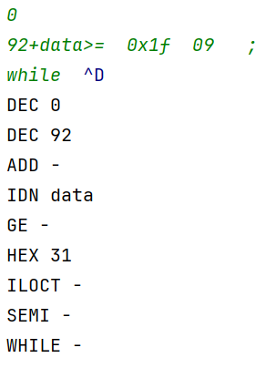
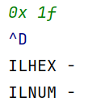
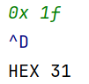
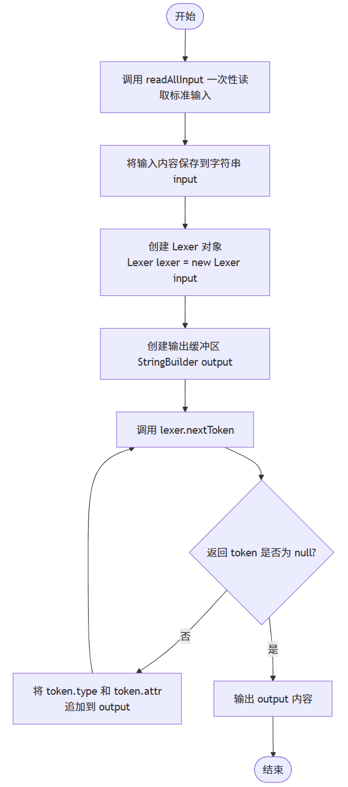
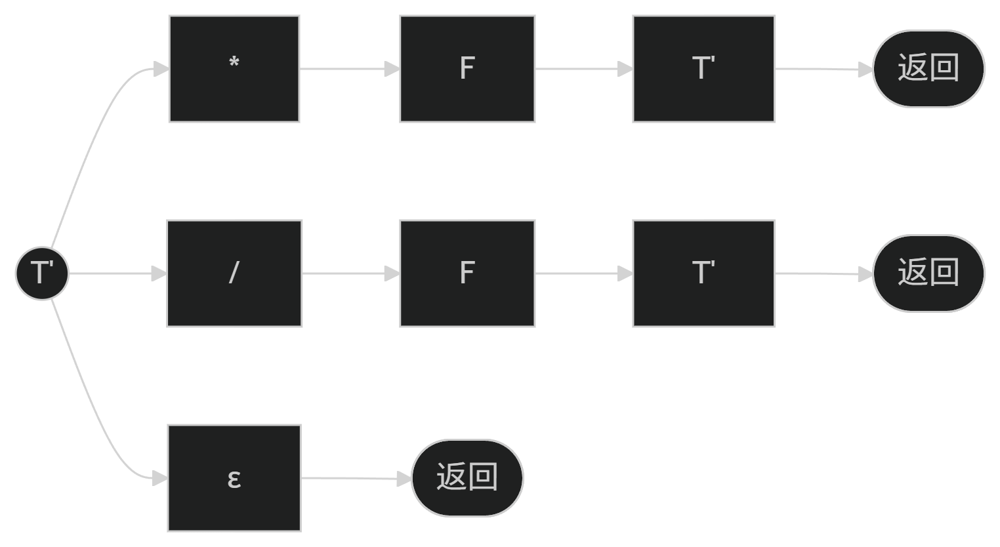
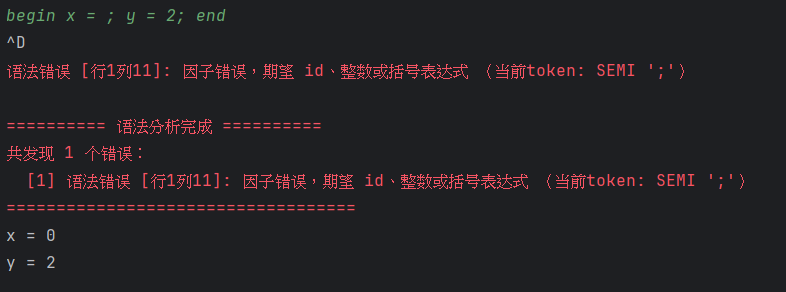
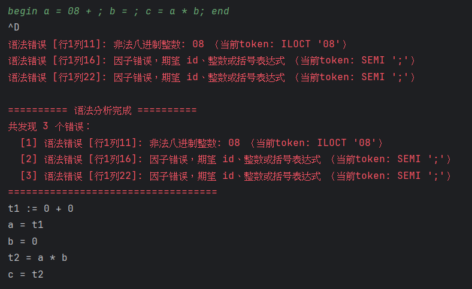

# 编译原理实验报告

> 本文件是最终提交报告的工作稿。报告主体应以《编译原理》课程实验要求为准，重点说明词法分析、语法分析、语法制导翻译、三地址代码生成等技术实现。工程化内容只作为可执行程序、测试和复现能力的补充说明。

## 0. 报告说明与事实源

本报告整合三部分工作：

1. 郑天白完成的 Lab 1 词法分析报告与实现事实；
2. 段晰迈完成的 Lab 2 递归下降语法分析报告与实现事实；
3. 高子涵完成的 Bison 路径、Lab 3 三地址代码生成、扩展功能、测试与可执行程序。

为尊重组员工作，Lab 1 与 Lab 2 章节以组员报告为主要事实源，不删除其已完成的正规式、正规文法、语法图、扩展功能与测试说明；本文只做必要的结构化整理、术语统一和与当前仓库实现的口径校准。

| 事实源 | 路径 | 用途 |
| --- | --- | --- |
| Lab 1 组员报告 | `docs/reports/member-sources/lab1.md` | 词法分析分工、正规式、正规文法、状态图、测试截图 |
| Lab 2 组员报告 | `docs/reports/member-sources/lab2.md` | 递归下降分析、消除左递归、语法图、扩展与测试截图 |
| 实验指导材料 | `material/lab1.pdf`、`material/lab2-3.pdf`、`material/handbook.pdf` | 实验要求、报告要求、标准测试样例 |
| 项目实现 | `src/` | 当前代码实现 |
| 项目说明 | `docs/lexer.md`、`docs/parser.md`、`docs/tac.md`、`docs/lab2-3-design-report.md` | 与实现同步的技术说明 |
| 自动化测试 | `tests/` | 可复现验证 |
| 演示材料 | `examples/` | 截图和报告证据 |

## 1. 基本信息与任务分工

| 项目 | 内容 |
| --- | --- |
| 课程 | 编译原理 |
| 实验 | 实验一：词法分析程序的设计与实现；实验二/三：语法制导的三地址代码生成 |
| 小组成员 | TODO：填写成员姓名、学号 |
| 提交内容 | 实验报告、源程序、可执行程序 |
| 可执行程序 | `dist/compiler-lab.jar`，由 `make dist` 生成 |
| 最终验证 | TODO：填写最终提交前 `make test` 结果与日期 |

| 成员 | 主要分工 | 技术内容 | 事实源 |
| --- | --- | --- | --- |
| 郑天白 | Lab 1 词法分析 | 输入处理、Token 识别、正规式、正规文法、状态图、词法测试 | `docs/reports/member-sources/lab1.md` |
| 段晰迈 | Lab 2 递归下降语法分析 | 消除左递归、递归下降子程序、语法图、语法树输出、错误处理扩展 | `docs/reports/member-sources/lab2.md` |
| 高子涵 | Lab 3 Bison 路径与三地址代码生成 | Bison 文法、AST、TAC 生成、错误恢复、扩展功能、测试、可执行程序 | `src/`、`docs/lab2-3-design-report.md`、`tests/`、`examples/` |
| 全组 | 总体联调与最终报告 | Lab 1/2/3 事实合并、报告整理、演示材料与提交包 | 本报告与仓库文档 |

## 2. 实验要求完成情况

| 实验要求 | 完成情况 | 证据 |
| --- | --- | --- |
| 词法分析器识别三种整数、标识符、主要运算符和关键字 | 已完成 | `examples/lab1/handout.*`、`tests/lab1_sample.*` |
| 给出词法正规式、正规文法、状态图、主要数据结构与算法 | 已完成，主体来自郑天白 Lab 1 报告 | `docs/reports/member-sources/lab1.md` |
| 语法分析程序输出语法树或最左派生产生式序列 | 已完成，递归下降路径输出语法树 | `examples/lab2/tree-sample.*`、`tests/lab2_tree_sample.*` |
| 源程序包含多个语句 | 已完成 | Lab 2/Lab 3 标准样例均包含多语句 |
| 对源程序错误做适当处理 | 已完成；Lab 2 有组员扩展说明，Lab 3 有定位与续编译 | `tests/lab2_tree_invalid_octal.*`、`tests/lab3_tac_error_*` |
| 按语法制导定义生成三地址代码 | 已完成 | `examples/lab3/handout-tac.*`、`tests/lab3_tac_sample.*` |
| 自动生成技术说明 | 已完成，Lab 3 使用 GNU Bison | `src/TacBisonParser.y`、`src/BisonTacParser.java` |
| 可执行程序 | 已完成 | `make dist`、`dist/compiler-lab.jar` |

## 3. 词法分析子系统

本节以郑天白 Lab 1 报告为主体事实源，保留其对词法分析子系统的设计说明。当前仓库中的 `src/Lexer.java` 与 `src/Token.java` 是 Lab 1、Lab 2、Lab 3 共用的词法实现。

### 3.1 子系统任务

词法分析子系统负责从标准输入读取源程序，将字符序列转换为一个个具有明确种别值和属性值的单词符号 Token。根据实验要求，需要识别：

1. 标识符；
2. 十进制整数；
3. 八进制整数；
4. 十六进制整数；
5. 主要运算符和分隔符；
6. 关键字；
7. 非法八进制数；
8. 非法十六进制数。

组员报告还说明了输入缓冲区行为：程序先完整读取标准输入，用户按下 Enter 或 EOF 后再交给词法分析、语法分析和中间代码生成模块处理。当前实现中，Lab 1 入口 `Main.main` 调用 `readAllInput()` 一次性读取输入，再构造 `new Lexer(input)` 逐个输出 token。

### 3.2 字符集与正规式

先定义字符集合：

```text
letter             = A|B|...|Z|a|b|...|z
digit              = 0|1|2|3|4|5|6|7|8|9
nonzero_digit      = 1|2|3|4|5|6|7|8|9
oct_digit          = 0|1|2|3|4|5|6|7
hex_digit          = digit|a|b|c|d|e|f|A|B|C|D|E|F
illegal_hex_letter = g|h|...|z|G|H|...|Z
underline          = _
id_start           = letter|underline
id_char            = letter|digit|underline
```

实验指导书中的标识符正规式为：

```text
IDN = letter(letter|digit)*
```

组员实现中扩展支持下划线，因此实际实现的标识符正规式为：

```text
IDN = (letter|_)(letter|digit|_)*
```

整数正规式：

```text
DEC   = 0 | nonzero_digit digit*
OCT   = 0 oct_digit+
HEX   = 0(x|X)hex_digit+
ILOCT = 0 digit* (8|9) digit*
ILHEX = 0(x|X)(digit|letter)* illegal_hex_letter (digit|letter)*
```

关键字正规式：

```text
KEYWORD = if|then|else|while|do|begin|end
```

运算符和分隔符正规式：

```text
OP        = +|-|*|/|>|<|=|>=|<=|<>
DELIMITER = (|)|;
```

### 3.3 单词种别设置

| 单词 | 种别值 | 属性值 |
| --- | --- | --- |
| 标识符 | `IDN` | 字符串 |
| 十进制整数 | `DEC` | 数值 |
| 八进制整数 | `OCT` | 数值 |
| 十六进制整数 | `HEX` | 数值 |
| `+` | `ADD` | `-` |
| `-` | `SUB` | `-` |
| `*` | `MUL` | `-` |
| `/` | `DIV` | `-` |
| `>` | `GT` | `-` |
| `<` | `LT` | `-` |
| `=` | `EQ` | `-` |
| `>=` | `GE` | `-` |
| `<=` | `LE` | `-` |
| `<>` | `NEQ` | `-` |
| `(` | `SLP` | `-` |
| `)` | `SRP` | `-` |
| `;` | `SEMI` | `-` |
| `if` | `IF` | `-` |
| `then` | `THEN` | `-` |
| `else` | `ELSE` | `-` |
| `while` | `WHILE` | `-` |
| `do` | `DO` | `-` |
| `begin` | `BEGIN` | `-` |
| `end` | `END` | `-` |
| 非法八进制数 | `ILOCT` | `-` |
| 非法十六进制数 | `ILHEX` | `-` |
| 其他非法数字 | `ILNUM` | `-` |
| 无法识别词素 | `UNKNOWN` | 原词素 |

### 3.4 正规文法

以下正规文法保留组员报告中的右线性文法设计。

标识符和关键字：

```text
S -> letter A | _ A
A -> letter A | digit A | _ A | ε
```

词法分析器识别到字符串后再判断是否属于关键字表。如果属于 `if`、`then`、`else`、`while`、`do`、`begin`、`end`，则输出关键字种别；否则输出 `IDN`。

十进制整数：

```text
S -> 0 | nonzero_digit B
B -> digit B | ε
```

八进制整数：

```text
S -> 0 C
C -> oct_digit D
D -> oct_digit D | ε
```

非法八进制整数：

```text
S -> 0 E
E -> oct_digit E | 8 F | 9 F
F -> digit F | ε
```

该文法表示：数字串以 `0` 开头，在出现 `8` 或 `9` 前可以出现合法八进制数字；一旦出现 `8` 或 `9`，该词素归类为非法八进制数。

十六进制整数：

```text
S -> 0 H
H -> x I | X I
I -> hex_digit J
J -> hex_digit J | ε
```

非法十六进制整数：

```text
S -> 0 H
H -> x K | X K
K -> hex_digit K | illegal_hex_letter L | ε
L -> digit L | letter L | ε
```

其中 `K -> ε` 用于覆盖 `0x` 或 `0X` 后没有任何十六进制数字的非法情况。

运算符和分隔符：

```text
S -> + | - | * | / | = | ( | ) | ;
S -> > M
M -> = | ε
S -> < N
N -> = | > | ε
```

### 3.5 状态图与组员原始截图

以下图片来自郑天白 Lab 1 报告，最终排版时应保留，并根据版面补充图题或重新绘制等价状态图。









TODO：确认 `image4.png` 在最终版中的图题。如果该图不是完整状态图，可依据 `Lexer.nextToken()`、`singleCharacterToken()`、`classifyLexeme()`、`classifyNumber()` 的控制流补一张状态图。

```text
start
  -> skipWhitespace
  -> relational operator branch
  -> single-character token branch
  -> collect lexeme
  -> keyword / identifier / number / unknown classification
```

### 3.6 主要数据结构

`Token` 是词法分析输出的基本单位：

```text
type   : token 种别值，如 IDN、DEC、WHILE
value  : 语义属性值，如标识符名、整数十进制值
lexeme : 原始词素，用于错误信息和非法 token 展示
line   : token 起始行
column : token 起始列
```

`Lexer` 维护输入状态：

```text
input  : 完整输入字符串
pos    : 当前扫描位置
length : 输入长度
line   : 当前行号
column : 当前列号
```

关键函数：

| 函数 | 作用 |
| --- | --- |
| `Lexer.nextToken()` | 词法分析主函数，每次返回一个 token |
| `skipWhitespace()` | 跳过空格、制表符、换行符 |
| `singleCharacterToken()` | 识别单字符运算符和分隔符 |
| `classifyLexeme()` | 将完整词素分类为关键字、标识符、数字或未知 |
| `classifyNumber()` | 区分 `DEC`、`OCT`、`HEX`、`ILOCT`、`ILHEX`、`ILNUM` |
| `convertBaseToDecimal()` | 将八进制/十六进制属性值转换为十进制字符串 |
| `advancePos()` | 推进位置并维护行列号 |

### 3.7 词法分析算法

`Lexer.nextToken()` 的算法流程：

```text
1. 调用 skipWhitespace() 跳过空白符。
2. 如果输入结束，返回 null。
3. 记录当前 token 起始行列号。
4. 如果当前字符是 >：
     若下一个字符是 =，返回 GE；
     否则返回 GT。
5. 如果当前字符是 <：
     若下一个字符是 =，返回 LE；
     若下一个字符是 >，返回 NEQ；
     否则返回 LT。
6. 尝试识别单字符运算符和分隔符。
7. 向后读取直到空白符或运算符/分隔符，得到完整词素 lexeme。
8. classifyLexeme(lexeme)：
     先查关键字表；
     再判断标识符；
     再判断数字；
     否则返回 UNKNOWN。
9. classifyNumber(lexeme)：
     识别 0、十进制、八进制、十六进制；
     检测非法八进制、非法十六进制和其他非法数字。
```

该算法对应手工词法分析器的典型状态机实现。当前代码没有使用 Lex/Flex，而是直接实现 DFA 风格的扫描与分类逻辑。

### 3.8 Lab 1 测试

运行命令：

```sh
java -jar dist/compiler-lab.jar lab1 < examples/lab1/handout.in
```

TODO：插入运行截图。输出应与 `examples/lab1/handout.out` 一致。

## 4. 语法分析子系统

本节分为 Lab 2 递归下降语法分析和 Lab 3 Bison 自动生成语法分析两部分。Lab 2 以段晰迈组员报告为主体事实源；Lab 3 说明自动生成技术、描述程序、辅助程序和生成 parser 的总体结构。

### 4.1 Lab 2 递归下降分析方法

组员报告选择递归子程序法，即递归下降分析法。其核心思想是：为文法的每个非终结符编写一个递归函数，通过函数间调用完成自顶向下的语法分析。当函数调用图与产生式结构一一对应时，分析过程可以看作从开始符号出发构造语法树。

原表达式文法存在左递归：

```text
E -> E + T | E - T | T
T -> T * F | T / F | F
```

消除左递归后：

```text
E  -> T E'
E' -> + T E' | - T E' | ε
T  -> F T'
T' -> * F T' | / F T' | ε
```

当前递归下降路径支持的主要产生式：

```text
P      -> L+
L      -> S ;
S      -> id = E
S      -> if C then S S'
S'     -> else S | ε
S      -> while C do S
S      -> begin L_list end
L_list -> S ; L_list | S ;
C      -> E relop E
relop  -> > | < | = | >= | <= | <>
E      -> T E'
T      -> F T'
F      -> ( E ) | id | int8 | int10 | int16
```

### 4.2 Lab 2 语法图

组员报告已经给出化简后的语法图，最终报告中应保留这些图，不应删减。以下图片均来源于段晰迈 Lab 2 报告。





TODO：最终排版时检查图片清晰度和大小，并标注“来源：段晰迈 Lab 2 报告”。

### 4.3 Lab 2 主要数据结构与函数

递归下降 parser 主要状态：

```text
lexer          : 共享词法器
lookahead      : 当前前看 token
indent         : 语法树输出缩进层级
errorCount     : 错误计数
errorMessages  : 错误信息列表
SYNC_STMT      : 语句级同步集合
SYNC_BLOCK     : 块级同步集合
```

主要函数对应非终结符：

| 函数 | 对应文法/职责 |
| --- | --- |
| `parseProgram()` | `P -> L+`，语法分析入口 |
| `parseL()` | `L -> S ;` |
| `parseS()` | 选择赋值、if、while、begin 分支 |
| `parseAssign()` | `S -> id = E` |
| `parseIf()` | `S -> if C then S S'` |
| `parseWhile()` | `S -> while C do S` |
| `parseCompound()` | `S -> begin L_list end` |
| `parseLList()` | 复合语句内部语句列表 |
| `parseC()` | `C -> E relop E` |
| `parseRelop()` | 六种关系运算符 |
| `parseE()` | `E -> T E'`，用循环处理加减 |
| `parseT()` | `T -> F T'`，用循环处理乘除 |
| `parseF()` | 标识符、整数和括号表达式 |
| `match()` | 匹配终结符并推进 token |
| `error()` | 记录带行列号的错误信息 |

### 4.4 Lab 2 递归下降算法

核心算法保留组员报告中的 LL(1) 递归下降描述：

```text
1. 每个非终结符对应一个 parseXxx() 方法。
2. 方法内部通过 check(type) 判断 lookahead 的 token 类型。
3. 根据 FIRST 集选择产生式分支。
4. 遇到终结符时调用 match(type) 消费 token。
5. 遇到非终结符时递归调用对应 parseXxx() 方法。
6. E' 和 T' 使用 while 循环实现，避免递归过深。
7. 出错时记录错误，并通过同步符号尝试继续分析。
```

`parseS()` 的分支选择：

```text
if lookahead == IDN:
    S -> id = E
else if lookahead == IF:
    S -> if C then S S'
else if lookahead == WHILE:
    S -> while C do S
else if lookahead == BEGIN:
    S -> begin L_list end
else:
    report error
```

### 4.5 Lab 2 扩展与测试

组员报告中列出的扩展应在最终报告中保留：

| 扩展 | 组员报告说明 |
| --- | --- |
| 全部六种关系运算符 | `parseRelop()` 支持 `GT`、`LT`、`EQ`、`GE`、`LE`、`NEQ` |
| 复合语句 | 新增 `S -> begin L_list end` 与 `L_list -> S ; L_list | S ;` |
| 非法数值检测与定位 | 词法层识别 `ILOCT`、`ILHEX`，语法层 `parseF()` 检测 |
| 进制自动转换 | `Lexer.convertBaseToDecimal(text, base)` 将八/十六进制转十进制属性值 |
| 错误定位 | `Token.line`、`Token.column` 与 `Lexer.advancePos()` 维护行列 |
| 续编译 | 出错后跳到同步符号继续分析，最终汇总错误 |

组员报告中的测试用例也应保留为成果来源：

- 缺少分号的隐式纠错；
- 缺表达式后的续编译；
- 非法整数的错误定位；
- 混合多种错误的续编译；
- 六种关系运算符正常工作验证。

组员测试截图：








TODO：最终排版时保留这些测试截图或换成同等内容的高清截图，并标注来源。

Lab 2 当前仓库演示命令：

```sh
java -jar dist/compiler-lab.jar tree < examples/lab2/tree-sample.in
```

## 5. Lab 3：Bison 语法分析与三地址代码生成

Lab 3 的主要目标是根据实验指导书中的语法制导定义生成三地址代码。本项目选择 GNU Bison 自动生成 Java parser。与 Lab 2 不同，Lab 3 主路径不直接使用递归下降 parser，而是：

```text
Lexer -> BisonTacParser.TacLexerAdapter -> TacBisonParser -> AST -> TacEmitter -> CodeGenerator -> TAC
```

### 5.1 自动生成技术说明

自动生成技术：

```text
GNU Bison 3.8.2
%language "Java"
%define api.parser.class {TacBisonParser}
%define api.value.type {Object}
%define parse.error verbose
```

描述程序：

```text
src/TacBisonParser.y
```

生成程序：

```text
build/generated/src/TacBisonParser.java
```

辅助程序：

| 文件 | 职责 |
| --- | --- |
| `BisonTacParser.java` | 适配共享 `Lexer` 与 Bison parser 接口 |
| `TacAst.java` | 定义 AST 节点 |
| `TacEmitter.java` | 将 AST 翻译为 TAC |
| `CodeGenerator.java` | 生成临时变量、标签和格式化输出 |
| `TacOptimizer.java` | 可选常量折叠 |

### 5.2 Bison 文法

核心文法：

```text
program          -> top_statements opt_semi
top_statements   -> statement
                  | top_statements ; statement
opt_semi         -> ε | ;
statement        -> id = expr
                  | if condition then statement
                  | if condition then statement else statement
                  | while condition do statement
                  | begin compound_statements end
                  | error
compound_stmt    -> statement ;
                  | compound_stmt statement ;
condition        -> expr relop expr
relop            -> > | < | = | >= | <= | <>
expr             -> expr + expr
                  | expr - expr
                  | expr * expr
                  | expr / expr
                  | ( expr )
                  | factor
factor           -> id | int8 | int10 | int16
```

Bison 中表达式优先级：

```text
%left ADD SUB
%left MUL DIV
```

这等价于传统表达式文法中 `E/T/F` 的优先级分层。加减优先级低于乘除，括号通过 `SLP expr SRP` 产生式改变归约结构。

dangling-else 处理：

```text
%nonassoc THEN
%nonassoc ELSE
statement -> IF condition THEN statement %prec THEN
statement -> IF condition THEN statement ELSE statement
```

该设计使 `else` 绑定到最近的未匹配 `if`。

### 5.3 AST 数据结构

为了避免在 Bison action 中直接生成三地址代码，Bison parser 规约时先构造 AST。

语句节点：

```text
TacProgram  : List<TacStatement>
TacAssign   : id, expr
TacIf       : condition, thenBranch, elseBranch
TacWhile    : condition, body
TacCompound : List<TacStatement>
TacError    : 错误恢复产生的错误语句
```

表达式节点：

```text
TacValue       : 标识符或常量
TacBinary      : left, op, right
TacInvalidExpr : 非法 token 传播使用
```

条件节点：

```text
TacCondition : left, op, right
```

AST 展示命令：

```sh
java -jar dist/compiler-lab.jar ast < examples/lab3/ast-sample.in
java -jar dist/compiler-lab.jar ast-dot < examples/lab3/ast-dot-sample.in
```

TODO：插入 AST 文本或 DOT 图。

### 5.4 语法制导定义与 TAC 规则

根据实验指导书中的语义规则，TAC 生成围绕 `place`、`code`、`true`、`false`、`next` 等属性展开。当前实现把这些属性体现在 `TacEmitter` 和 `CodeGenerator` 中。

赋值语句：

```text
S -> id = E
S.code = E.code || gen(id.place := E.place)
```

实现函数：

```text
TacEmitter.emitAssign(TacAssign statement)
```

算法：

```text
place = emitExpr(statement.expr)
emit(statement.id + " = " + place)
```

条件语句：

```text
S -> if C then S1
C.true = newlabel
C.false = S.next
S.code = C.code || gen(C.true:) || S1.code
```

`if-else`：

```text
S -> if C then S1 else S2
C.true = newlabel
C.false = newlabel
S1.next = S2.next = S.next
S.code = C.code || gen(C.true:) || S1.code
       || gen(goto S.next) || gen(C.false:) || S2.code
```

实现函数：

```text
TacEmitter.emitIf(TacIf statement, String nextLabel)
```

循环语句：

```text
S -> while C do S1
S.begin = newlabel
C.true = newlabel
C.false = S.next
S1.next = S.begin
S.code = gen(S.begin:) || C.code || gen(C.true:) || S1.code || gen(goto S.begin)
```

实现函数：

```text
TacEmitter.emitWhile(TacWhile statement, String nextLabel, String currentLabel)
```

条件表达式：

```text
C -> E1 relop E2
C.code = E1.code || E2.code
       || gen(if E1.place relop E2.place goto C.true)
       || gen(goto C.false)
```

实现函数：

```text
TacEmitter.emitCondition(TacCondition condition, String trueLabel, String falseLabel)
```

算术表达式：

```text
E -> E1 + T
E.place = newtemp
E.code = E1.code || T.code || gen(E.place := E1.place + T.place)
```

实现函数：

```text
TacEmitter.emitExpr(TacExpr expr)
CodeGenerator.newTemp()
```

### 5.5 CodeGenerator 数据结构

`CodeGenerator` 负责输出层面的属性管理：

| 字段/函数 | 作用 |
| --- | --- |
| `tempCount` | 生成 `t1`、`t2`、... |
| `labelCount` | 生成 `L1`、`L2`、... |
| `usedProgramNextLabel` | 保证首个程序级汇合标签为 `L0` |
| `codes` | 保存 TAC 指令序列 |
| `referencedLabels` | 记录实际被跳转引用的标签 |
| `newTemp()` | 创建临时变量 |
| `newLabel()` | 创建普通标签 |
| `newProgramNextLabel()` | 创建程序级后继标签 |
| `emit()` | 输出普通 TAC |
| `emitLabel()` | 输出标签 |
| `emitGoto()` | 输出跳转并记录标签引用 |
| `patchGoto()` | 回填跳转目标 |
| `getCodes()` | 格式化输出，尽量将标签和下一条指令合并 |

### 5.6 错误处理与续编译

Lab 3 错误处理分为语法错误和非法 token 两类。

语法错误：

```text
statement -> error
```

Bison 发现错误后调用 `yyerror`，`BisonTacParser.TacLexerAdapter.yyerror()` 记录：

```text
语法错误 [行X列Y]: message（当前token: TYPE 'lexeme'）
```

非法 token：

```text
factor -> ILOCT
factor -> ILHEX
factor -> ILNUM
factor -> UNKNOWN
```

这些分支调用 `yyerror(...)`，然后返回 `TacInvalidExpr`。如果赋值表达式或条件表达式中包含 `TacInvalidExpr`，对应语句构造成 `TacError`。`TacEmitter.emitProgram()` 遇到 `TacError` 时跳过该语句，从而实现续编译。

示例命令：

```sh
java -jar dist/compiler-lab.jar tac < examples/lab3/invalid-token-recovery.in
```

TODO：插入错误定位与续编译截图。

## 6. 扩展内容

### 6.1 全部六种关系运算符

Lab 2 递归下降路径中，组员报告说明 `parseRelop()` 通过前看 token 类型 `GT`、`LT`、`EQ`、`GE`、`LE`、`NEQ` 匹配六种关系运算符。

Lab 3 Bison 路径中：

```text
relop -> GT | LT | EQ | GE | LE | NEQ
```

证据：

```text
examples/lab3/relop-extended.in
examples/lab3/relop-extended.out
```

### 6.2 复合语句

Lab 2 组员报告中新增：

```text
S -> begin L_list end
L_list -> S ; L_list | S ;
```

Lab 3 Bison 路径中对应：

```text
statement -> BEGIN compound_statements END
compound_statements -> statement SEMI
                    | compound_statements statement SEMI
```

证据：

```text
examples/lab3/compound-while.in
examples/lab3/compound-while.out
```

### 6.3 错误定位与续编译

Lab 2 组员报告中给出缺分号、缺表达式、非法整数和混合错误用例。当前 Lab 3 路径也实现了语句级错误恢复和非法 token 恢复。

证据：

```text
examples/lab3/syntax-recovery.out
examples/lab3/invalid-token-recovery.out
tests/lab3_tac_error_*.expected
```

### 6.4 AST 展示与 DOT 输出

为了展示 Bison parser 的中间结构，项目提供：

```sh
java -jar dist/compiler-lab.jar ast < examples/lab3/ast-sample.in
java -jar dist/compiler-lab.jar ast-dot < examples/lab3/ast-dot-sample.in
```

该功能不是替代三地址代码输出，而是用于报告中说明 `Parser -> AST -> TAC` 的结构。

### 6.5 常量折叠

`TacOptimizer.foldConstants()` 在 AST 层递归遍历表达式。当 `TacBinary` 左右两侧都是整数常量时，调用 `foldValues(left, op, right)` 计算结果，并替换为 `TacValue`。除法遇到除数 0 时不折叠。

证据：

```text
examples/lab3/constant-folding.in
examples/lab3/constant-folding.out
```

### 6.6 MiniYacc/SLR 原理展示

`MiniSlrDemo` 使用固定表达式文法：

```text
(0) S' -> E
(1) E -> E + T
(2) E -> T
(3) T -> T * F
(4) T -> F
(5) F -> ( E )
(6) F -> id
```

输出内容：

- LR(0) 项目集族；
- GOTO 转移；
- ACTION/GOTO 分析表；
- LR(0) 状态自动机 DOT。

该功能用于展示“自己做 YACC”方向中的核心原理，但不替代 Lab 3 主线 Bison parser。

## 7. 测试与可执行程序

### 7.1 自动化测试

测试命令：

```sh
make test
```

覆盖范围：

- Lab 1 指导书样例；
- 共享 lexer 合同；
- Lab 2 语法树输出和非法八进制错误；
- Lab 3 指导书 TAC 样例；
- 表达式优先级、嵌套控制流；
- 扩展关系运算、复合语句、dangling else；
- 多类语法错误与非法 token 恢复；
- AST 文本、AST DOT；
- 常量折叠；
- MiniYacc/SLR 表和 DOT；
- 可执行 JAR 代表性 smoke tests。

TODO：插入最终 `make test` 通过截图。

### 7.2 演示材料

报告截图建议来自 `examples/`：

| 内容 | 输入 | 输出 |
| --- | --- | --- |
| Lab 1 词法分析 | `examples/lab1/handout.in` | `examples/lab1/handout.out` |
| Lab 2 语法树 | `examples/lab2/tree-sample.in` | `examples/lab2/tree-sample.out` |
| Lab 3 TAC | `examples/lab3/handout-tac.in` | `examples/lab3/handout-tac.out` |
| 关系运算扩展 | `examples/lab3/relop-extended.in` | `examples/lab3/relop-extended.out` |
| 复合语句 | `examples/lab3/compound-while.in` | `examples/lab3/compound-while.out` |
| 错误恢复 | `examples/lab3/syntax-recovery.in` | `examples/lab3/syntax-recovery.out` |
| 非法 token 恢复 | `examples/lab3/invalid-token-recovery.in` | `examples/lab3/invalid-token-recovery.out` |
| AST 展示 | `examples/lab3/ast-sample.in` | `examples/lab3/ast-sample.out` |
| 常量折叠 | `examples/lab3/constant-folding.in` | `examples/lab3/constant-folding.out` |
| MiniYacc/SLR | 无输入 | `examples/minislr/table.out` |

### 7.3 可执行程序

构建：

```sh
make dist
```

生成：

```text
dist/compiler-lab.jar
```

运行：

```sh
java -jar dist/compiler-lab.jar lab1 < examples/lab1/handout.in
java -jar dist/compiler-lab.jar tree < examples/lab2/tree-sample.in
java -jar dist/compiler-lab.jar tac < examples/lab3/handout-tac.in
java -jar dist/compiler-lab.jar tac-opt < examples/lab3/constant-folding.in
java -jar dist/compiler-lab.jar ast < examples/lab3/ast-sample.in
java -jar dist/compiler-lab.jar minislr
```

TODO：插入 `make dist` 和 `java -jar dist/compiler-lab.jar help` 截图。

## 8. 实验体会

TODO：最终稿中建议每位成员保留一段体会，不要只写统一总结。

可写方向：

- 词法分析中正规式、正规文法和状态图之间的关系；
- 递归下降分析中消除左递归、语法图和子程序结构之间的关系；
- Bison 自动生成 parser 与手写递归下降 parser 的差异；
- AST 中间表示对语法制导翻译和三地址代码生成的帮助；
- 错误定位、续编译和自动化测试对编译器实验可靠性的影响。

## 附录 A：截图清单

- [ ] Lab 1 指导书样例运行截图；
- [ ] Lab 1 正规文法/状态图截图或重绘图；
- [ ] Lab 2 语法图截图；
- [ ] Lab 2 语法树输出截图；
- [ ] Lab 3 指导书三地址代码输出截图；
- [ ] 至少 3 项扩展功能截图；
- [ ] 错误定位与续编译截图；
- [ ] `make test` 全部通过截图；
- [ ] `make dist` / `java -jar ... help` 截图；
- [ ] 可选：AST DOT 渲染图或 DOT 文本截图；
- [ ] 可选：MiniYacc/SLR ACTION/GOTO 表截图。

## 附录 B：最终提交前检查表

- [ ] 成员姓名、学号、分工填写完毕；
- [ ] Lab 1/Lab 2 组员报告中的图和测试说明已保留；
- [ ] 所有 `TODO` 均已处理或明确删去；
- [ ] 报告截图与 `examples/` 输出一致；
- [ ] `make test` 通过；
- [ ] `make dist` 生成 `dist/compiler-lab.jar`；
- [ ] 提交包包含实验报告、源程序、可执行程序；
- [ ] 未提交 `build/`、`.cache/` 等临时产物。

## 附录 C：组员原始报告保留说明

组员原始报告不在本文件中删改，作为最终报告的重要事实源保留在：

- `docs/reports/member-sources/lab1.md`
- `docs/reports/member-sources/lab2.md`

最终报告如需压缩篇幅，应优先压缩本人的工程化补充说明，而不应删除组员报告中已经完成的正规式、正规文法、语法图、测试用例和截图事实。
