# 编译原理实验报告

## 0. 实验目的

本次实验的目标是完成一个微型编译程序的主要前端流程，包括词法分析、语法分析和三地址代码生成。实验中首先实现词法分析器，将源程序分解为 token；然后实现实验二要求的递归下降语法分析器，输出语法树或最左派生结构；最后使用 Bison 生成语法分析器，并在此基础上完成实验三的三地址代码生成。

在完成基本要求的基础上，本组还补充了非法数值识别、错误定位、续编译、复合语句、扩展关系运算、AST/DOT 展示、常量折叠和 MiniSLR 原理展示等内容。

## 1. 实验任务分工

| 成员 | 负责内容 | 主要交付 |
| --- | --- | --- |
| 郑天白 | 词法分析子系统 | 输入处理、Token 识别、三类整数与非法整数检测 |
| 段晰迈 | 实验二递归下降语法分析 | 递归下降 parser、语法树/最左派生输出、错误处理扩展功能 |
| 高子涵 | Bison 语法分析与三地址代码生成 | Bison parser、AST、TAC 生成、错误恢复、优化、DOT 与 MiniSLR 展示 |

整体集成目标是形成一个微型编译程序：词法分析器识别源程序 token，语法分析器判断语法结构，三地址代码生成器输出中间代码，并通过自动化测试验证基本要求和扩展能力。

## 2. 基本要求与验证材料

| 要求 | 对应材料 | 验证方式 |
| --- | --- | --- |
| 词法分析：识别标识符、关键字、整数、运算符和分隔符 | 词法分析样例截图、Token 输出截图 | `lab1_sample`、`lexer_contract` |
| 语法分析：判断源程序是否符合文法 | 递归下降语法树截图、Bison 解析样例 | `lab2_tree_sample`、Bison TAC 相关 fixture |
| 实验二：输出语法树或最左派生结构 | `--tree` 输出截图 | `Experiment2 --tree` |
| 实验三：生成三地址代码 | 指导书样例 TAC 输出截图 | `Experiment2 --tac` |
| 多语句处理 | 顶层语句序列、复合语句样例截图 | 顶层语句序列与复合语句测试 |
| 基本错误处理 | 错误定位、语句级恢复截图 | 错误恢复 fixture |
| 指导书样例正确运行 | 自动化测试通过截图 | `make test` |

{ width=5.8in }

## 3. 词法分析子系统

本节依据组员词法分析报告整理，保留原始验证截图。词法分析模块负责从标准输入读取源程序，并将字符序列转换成具有种别值和属性值的 token。

指导书样例运行结果如下：

{ width=3.1in }

组员还实现并验证了输入缓冲区行为：用户在按下 Enter 前对当前输入行的修改会影响最终输入；按下 Enter 后再修改不会改变已经提交给编译器的源程序。

{ width=1.4in }

{ width=1.2in }

### 3.1 正规式描述

词法分析器将源程序字符流转换为 token 序列。主要 token 类型如下：

| 类别 | 正规式或说明 |
| --- | --- |
| 标识符 | `letter(letter|digit)*`，实现中扩展支持下划线 |
| 十进制整数 | `0 | nonzero_digit digit*` |
| 八进制整数 | `0 oct_digit+` |
| 十六进制整数 | `0x hex_digit+ | 0X hex_digit+` |
| 关键字 | `if | then | else | while | do | begin | end` |
| 运算符 | `+ - * / > < = >= <= <>` |
| 分隔符 | `( ) ;` |
| 非法整数 | 非法八进制、非法十六进制、其他非法数字形式 |

### 3.2 变换后的正规文法

以标识符和整数为例，正规式可转换为右线性正规文法：

```text
IDN:
S -> letter A
A -> letter A | digit A | ε

DEC:
S -> 0 | nonzero_digit B
B -> digit B | ε

OCT:
S -> 0 C
C -> oct_digit C | ε

HEX:
S -> 0 P
P -> x H | X H
H -> hex_digit H | hex_digit
```

非法八进制和非法十六进制通过进入错误状态识别。例如 `09` 归类为非法八进制整数，`0xg` 归类为非法十六进制整数。

### 3.3 状态图

状态图素材来自组员词法分析报告。原报告中的综合状态图如下：

{ width=4.4in }

### 3.4 主要数据结构与算法

主要数据结构：

- `Token`：保存 token 类型、词素、属性值、行号和列号；
- 关键字表：将 `if/then/else/while/do/begin/end` 从普通标识符中区分出来；
- 输入缓冲与当前位置：记录扫描下标、当前行列位置。

算法基本思想：

1. 跳过空白字符并维护行列号；
2. 根据首字符选择识别分支；
3. 对标识符先按标识符规则读取，再查关键字表；
4. 对数字按前缀区分十进制、八进制、十六进制，并检测非法形式；
5. 对双字符运算符如 `>=`、`<=`、`<>` 使用前瞻判断；
6. 返回 token 序列供语法分析子系统使用。

## 4. 语法分析子系统

- 实验二递归下降 + CodeGenerator 兼容：负责 `--tree` 语法树/最左派生输出；
- 实验二/三主路径：GNU Bison 生成 parser，负责 AST 构建和三地址代码生成。

### 4.1 递归下降语法分析

本节说明递归下降分析方法、消除左递归说明、语法图和测试截图。实验二递归下降 parser 使用消除左递归后的文法。核心产生式如下：

```text
P  -> L P | ε
L  -> S ;
S  -> id = E
    | if C then S
    | if C then S else S
    | while C do S
    | begin L_list end
C  -> E relop E
E  -> T E'
E' -> + T E' | - T E' | ε
T  -> F T'
T' -> * F T' | / F T' | ε
F  -> ( E ) | id | int8 | int10 | int16
```

主要算法：

- 每个非终结符对应一个 `parseXxx()` 方法；
- 使用 lookahead token 判断产生式分支；
- 终结符通过 `match()` 消费；
- `E'`、`T'` 使用循环实现，避免左递归；
- 语法树输出通过缩进表示推导层次。

S 的语法图：

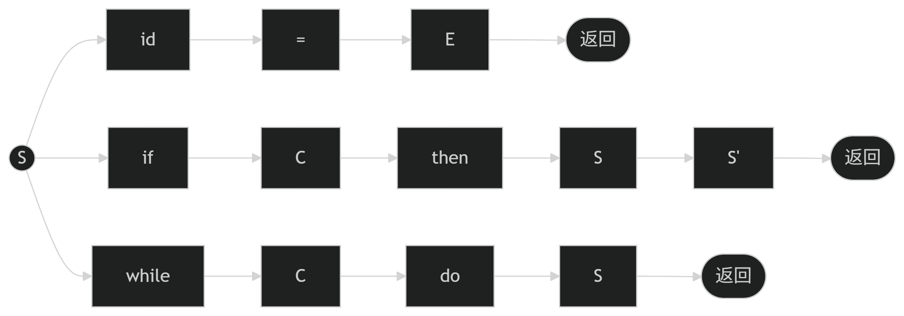{ width=4.2in }

S' 的语法图：

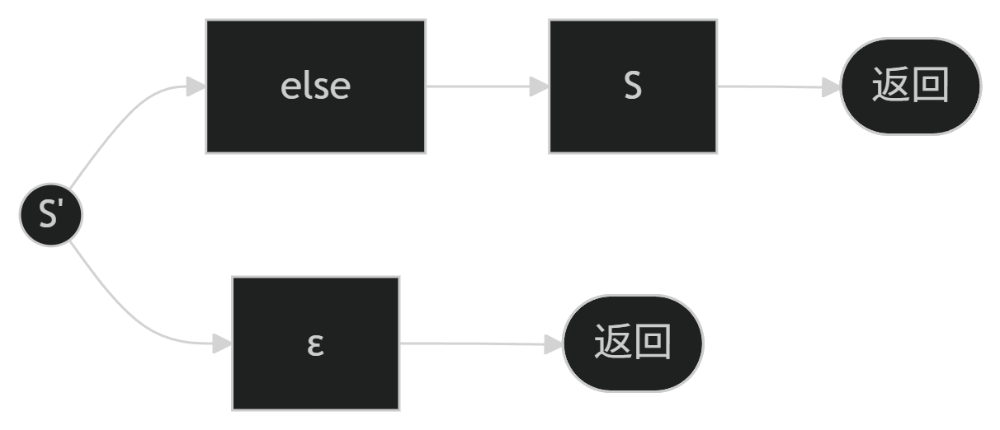{ width=2.4in }

C 的语法图：

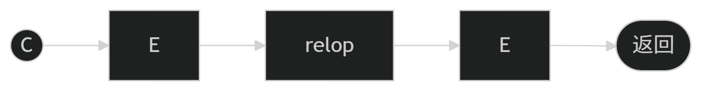{ width=4.3in }

E 的语法图：

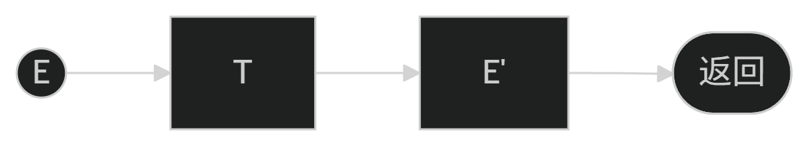{ width=3.3in }

E' 的语法图：

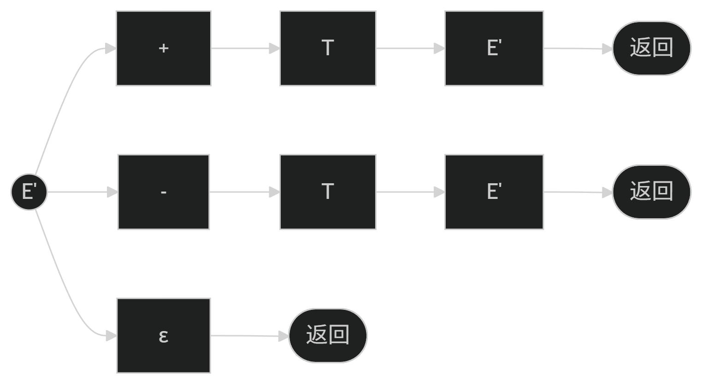{ width=3.8in }

T 的语法图：

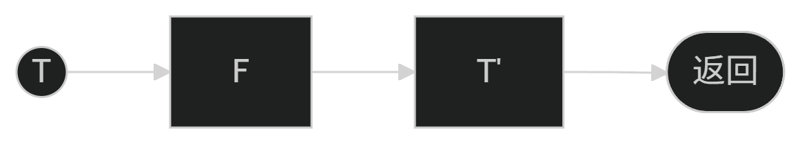{ width=3.2in }

T' 的语法图：

{ width=4.3in }

F 的语法图：

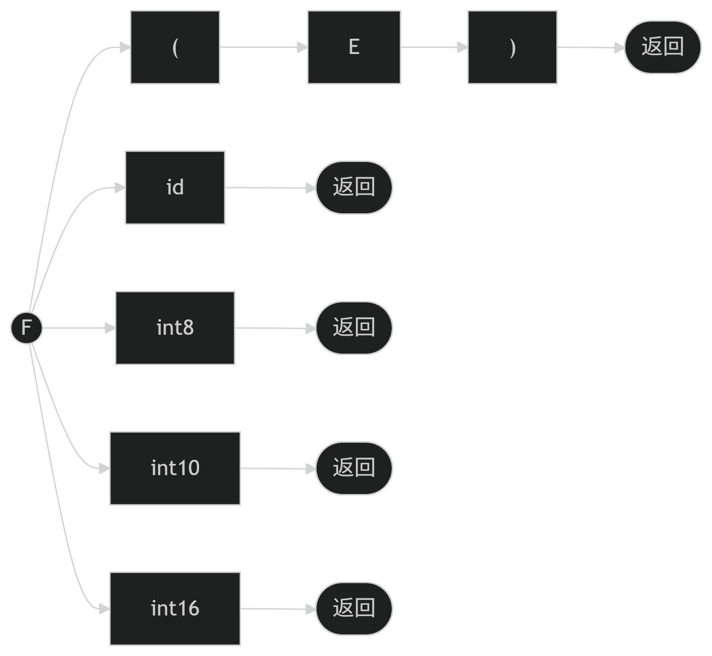{ width=4.0in }

六种关系运算符验证：

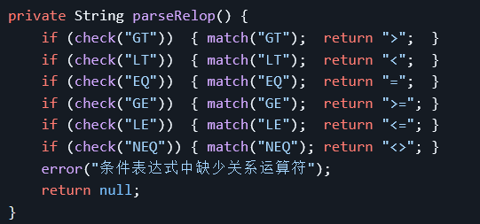{ width=4.9in }

复合语句验证：

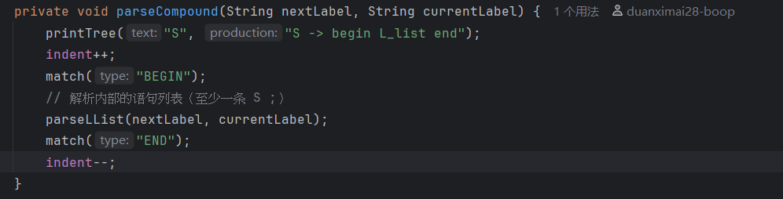{ width=5.8in }

非法数值检测与定位：

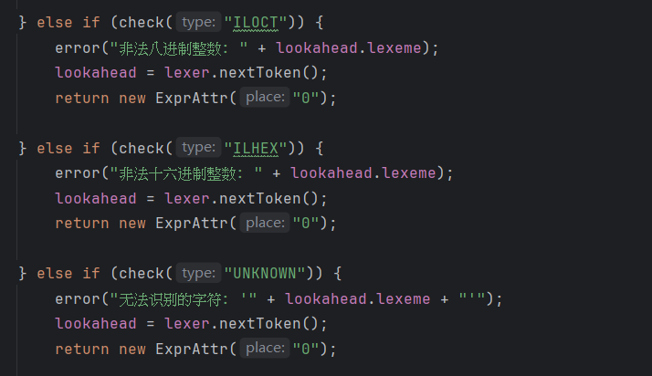{ width=5.8in }

续编译与错误处理测试：

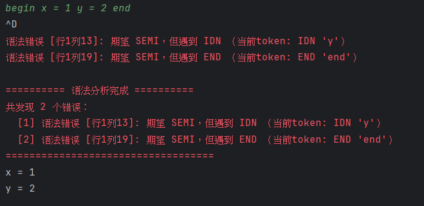{ width=5.8in }

{ width=5.8in }

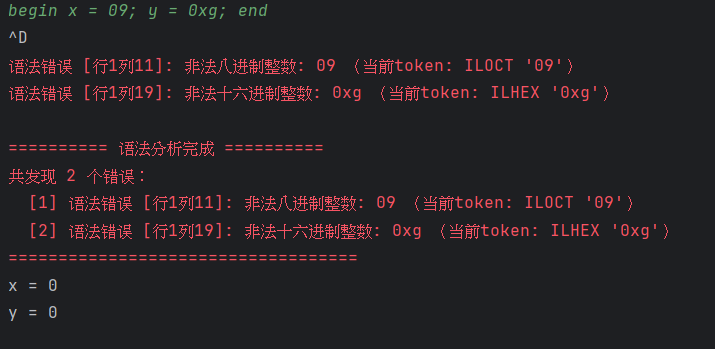{ width=5.8in }

{ width=5.8in }

综合关系符测试：

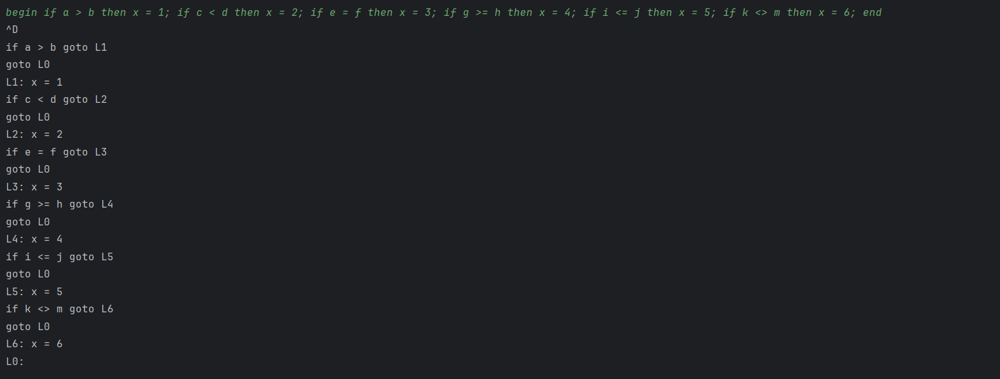{ width=5.8in }

### 4.2 Bison 语法分析

实验二/三主路径采用 GNU Bison 的 Java parser 生成功能。描述程序为：

```text
src/TacBisonParser.y
```

生成结果为：

```text
build/generated/src/TacBisonParser.java
```

Bison 文法核心如下：

```text
program        -> top_statements opt_semi
statement      -> id = expr
                | if condition then statement
                | if condition then statement else statement
                | while condition do statement
                | begin compound_statements end
                | error
condition      -> expr relop expr
relop          -> > | < | = | >= | <= | <>
expr           -> expr + expr
                | expr - expr
                | expr * expr
                | expr / expr
                | ( expr )
                | factor
factor         -> id | int8 | int10 | int16
```

辅助程序和总体结构：

- `BisonTacParser`：将实验一 `Lexer` 适配为 Bison lexer 接口；
- `TacAst`：保存 Bison parser 规约得到的 AST；
- `TacEmitter`：遍历 AST 生成三地址代码；
- `CodeGenerator`：管理临时变量、标号和输出格式；
- `TacOptimizer`：可选执行常量折叠；
- `TacAstPrinter`、`TacAstDotPrinter`：输出 AST 文本和 Graphviz DOT。

表达式优先级通过 Bison 声明控制：

```text
%left ADD SUB
%left MUL DIV
```

`if-then-else` 的 dangling else 问题通过 `%nonassoc THEN`、`%nonassoc ELSE` 与 `%prec THEN` 处理，使 `else` 绑定到最近的未匹配 `if`。

Bison 路径还提供 AST 文本展示和 DOT 图展示，便于观察语法分析后的中间结构：

{ width=5.8in }

{ width=5.8in }

## 5. 三地址代码生成器

### 5.1 语法制导定义

三地址代码生成基于 AST 后序遍历。表达式节点返回计算结果位置，语句节点负责拼接控制流。

赋值语句：

```text
S -> id = E
S.code = E.code || id = E.place
```

二元表达式：

```text
E -> E1 op E2
E.place = newtemp()
E.code = E1.code || E2.code || E.place := E1.place op E2.place
```

条件语句：

```text
C -> E1 relop E2
C.code = if E1.place relop E2.place goto C.true
         goto C.false
```

循环语句：

```text
S -> while C do S1
S.code = begin_label:
         C.code
         true_label: S1.code
         goto begin_label
         false_label:
```

### 5.2 算法基本思想

1. Bison parser 先构造 AST，而不是在规约动作中直接输出 TAC；
2. `TacEmitter` 遍历 AST；
3. 表达式生成临时变量 `t1`、`t2` 等；
4. 控制流生成标号 `L0`、`L1` 等；
5. `if/else` 和 `while` 使用条件跳转与无条件跳转连接基本块；
6. 可选 `--tac-opt` 在 AST 层先执行常量折叠，再生成 TAC。

示例：

```text
x = a + b * c;
```

输出：

```text
t1 = b * c
t2 = a + t1
x = t2
```

指导书样例的三地址代码输出如下：

{ width=5.8in }

## 6. 扩展内容与验证材料

| 扩展内容 | 功能说明 | 验证材料 |
| --- | --- | --- |
| 全部关系运算符 | 支持 `> < = >= <= <>` | 组员关系符测试截图、`lab3_tac_relop_extended` |
| 复合语句 | 支持 `begin ... end` 多语句块 | 组员复合语句截图、`lab3_tac_compound` |
| 嵌套控制流 | 支持嵌套 `if/else` 和 `while` | `lab3_tac_nested_control` |
| dangling else | `else` 绑定到最近的未匹配 `if` | `lab3_tac_dangling_else` |
| 错误定位 | 错误信息包含行号、列号、当前 token | 组员错误定位截图、错误恢复 fixture |
| 语句级错误恢复 | 错误语句不生成 TAC，后续合法语句继续翻译 | `lab3_tac_error_*` |
| AST 文本展示 | 展示 Bison parser 得到的 AST | `Experiment2 --ast` |
| AST DOT 输出 | 输出 Graphviz DOT，用于报告和 PPT 图示 | `Experiment2 --ast-dot` |
| 常量折叠 | 对常量表达式进行简单优化 | `Experiment2 --tac-opt` |
| MiniSLR 分析表展示 | 固定表达式文法输出 LR(0) item、GOTO、ACTION/GOTO | `MiniSlrDemo` |
| MiniSLR 自动机 DOT | 输出 LR(0) 状态自动机 DOT | `MiniSlrDemo --dot` |

错误恢复测试覆盖：

- 表达式缺项后续编译；
- 缺右括号；
- `if` 缺 `then`；
- 复合语句内部错误；
- 连续多个错误语句。

语句级错误恢复输出示例：

{ width=5.8in }

常量折叠优化输出示例：

{ width=5.8in }

MiniSLR 自动机 DOT 渲染结果：

{ width=5.8in }

边界说明：当前错误恢复是语句级恢复，不做复杂自动纠错；MiniSLR 是固定表达式文法原理展示，不是通用 parser generator。

## 7. 测试与运行

构建：

```sh
make build
```

运行实验二语法树：

```sh
java -cp build/classes Experiment2 --tree < tests/lab2_tree_sample.in
```

运行三地址代码：

```sh
java -cp build/classes Experiment2 --tac < tests/lab3_tac_sample.in
```

运行优化 TAC：

```sh
java -cp build/classes Experiment2 --tac-opt < tests/lab3_tac_constant_folding.in
```

运行 AST DOT：

```sh
java -cp build/classes Experiment2 --ast-dot < tests/lab3_ast_dot_sample.in
```

运行 MiniSLR 表格和自动机：

```sh
java -cp build/classes MiniSlrDemo
java -cp build/classes MiniSlrDemo --dot
```

自动化测试：

```sh
make test
```

当前测试覆盖 20 个 fixture，包括词法、实验二语法树、实验三 TAC、错误恢复、AST/DOT、优化和 MiniSLR 展示。

## 8. 实验体会

本实验将词法分析、语法分析和中间代码生成串联成一个完整编译前端。递归下降 parser 便于理解自顶向下分析过程，Bison parser 更适合承载实验三中更复杂的语法制导翻译。通过 AST 中间层，语法分析和 TAC 生成保持解耦，后续扩展错误恢复、DOT 可视化和常量折叠时不会破坏默认三地址代码输出。

本次实验也加深了我们对自动生成技术的理解：主线 parser 由 Bison 根据 `.y` 描述程序生成，手写代码主要集中在 lexer 适配、AST 建模和 TAC 生成部分；同时通过 MiniSLR 展示 closure、GOTO 和 ACTION/GOTO 表，补充说明 parser generator 的基本原理。

总体来看，本组完成了实验指导书的基本要求，并在错误处理、语言结构、可视化展示和中间代码优化方面做了适当扩展。各模块既可以单独展示，也可以通过自动化测试证明整体流程能够稳定运行。
