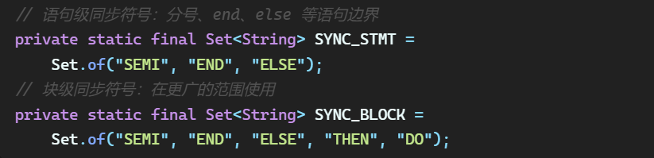
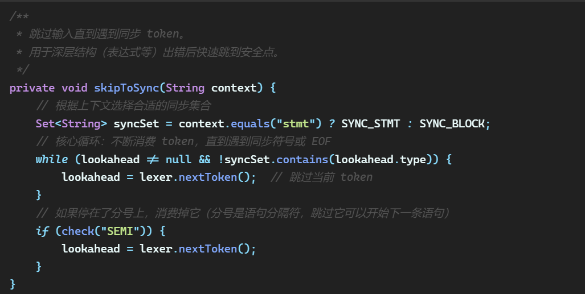

## 二，基础功能

### 2.1实验二功能说明

根据实验指导书的要求，本实验需要采用递归子程序法（递归下降分析法）构造语法分析程序，实现以下基本功能：

1.  语法分析：对输入的源程序进行语法分析，判断其是否符合给定的文法规则。

2.  输出语法树：按照最左派生的顺序，以缩进格式输出派生的产生式序列（即语法树）。

3.  多语句支持：处理的源程序可以包含多个语句，每条语句以分号结尾。

4.  基本错误处理：分析程序能够对源程序中的语法错误做出适当的处理（如报告错误信息）。

### 2.2实验二基本功能实现方法

#### 2.2.1分析方法选择

本实验选用递归下降分析法（RecursiveDescentParsing），这是一种自顶向下的语法分析方法。其核心思想是：为文法的每一个非终结符编写一个递归函数（子程序），通过函数之间的相互调用来完成语法分析。当函数调用图与文法产生式结构一一对应时，分析过程即为从开始符号出发、试图为输入串构造一棵语法树的过程。

#### 2.2.2 消除左递归

原产生式如下：

| 非终结符 | 产生式                 | 说明                   |
|----------|------------------------|------------------------|
| P        | P → L P \| ε           | 程序：语句列表（可空） |
| L        | L → S ;                | 单条语句加分号         |
| S        | S → id = E             | 赋值语句               |
| S        | S → if C then S        | if 语句（无 else）     |
| S        | S → if C then S else S | if-else 语句           |
| S        | S → while C do S       | while 循环语句         |
| C        | C → E \> E             | 大于条件               |
| C        | C → E \< E             | 小于条件               |
| C        | C → E = E              | 等于条件               |
| E        | E → E + T              | ⚠️ 左递归              |
| E        | E → E - T              | ⚠️ 左递归              |
| E        | E → T                  |                        |
| T        | T → T \* F             | ⚠️ 左递归              |
| T        | T → T / F              | ⚠️ 左递归              |
| T        | T → F                  |                        |
| F        | F → ( E )              | 括号表达式             |
| F        | F → id                 | 标识符                 |
| F        | F → int8               | 八进制整数             |
| F        | F → int10              | 十进制整数             |
| F        | F → int16              | 十六进制整数           |

左递归消除：

<table>
<colgroup>
<col style="width: 48%" />
<col style="width: 51%" />
</colgroup>
<thead>
<tr class="header">
<th>原产生式</th>
<th>消除左递归产生式</th>
</tr>
</thead>
<tbody>
<tr class="odd">
<td>E → E + T | E - T | T</td>
<td>
E → T E'E' → + T

E' | - T E' | ε
</td>
</tr>
<tr class="even">
<td>T → T * F | T / F | F</td>
<td>
T → F T'

T' → * F T' | / F T' | ε
</td>
</tr>
</tbody>
</table>

#### 2.2.3 实验二的语法图 

S的语法图：

S’的语法图

C的语法图

E的语法图

E’的语法图

T的语法图

T’的语法图

F的语法图

#### 2.2.5 核心数据结构与算法

核心算法——LL(1) 递归下降：

每个非终结符对应一个 parseXxx() 私有方法。

在方法内部，通过 check(type) 判断当前 lookahead 的类型来选择产生式分支。

选中分支后，按产生式右部的符号顺序依次调用对应的 parseXxx() 或 match()。

> 遇到终结符时调用 match() 消费 token 并前进；遇到非终结符时递归调用对应方法。

消除左递归后的 E' 和 T' 使用 while 循环 而非递归函数实现，避免了深层递归调用。

分支选择逻辑示例（以 S 为例）：

// parseS 中的产生式选择（LL(1)）

if (check("IDN")) S → id = E （赋值语句）

else if (check("IF")) S → if C then S S'（条件语句）

else if (check("WHILE")) S → while C do S （循环语句）

else if (check("BEGIN")) S → begin L_list end（复合语句）

else 报错：无法识别的语句开头

### 2.3 测试用例

实验指导书上的标准测试用例为：

while (a3+15)\>0xa do if x2 = 07 then while y\<z do y = x \* y / z; c=b\*c+d;

预期输出：

以 --tree 模式运行，语法分析器应按照最左派生的顺序，以缩进格式输出完整的产生式序列。关键输出特征：

1)  程序从 P 开始，缩进表示派生层次

2)  每个 token 的种别和属性值被逐行打印（如 IDN : a3、DEC : 15、HEX : 10）

3)  每个非终结符展开时打印产生式标注（如 \[S -\> while C do S\]、\[E -\> T E'\]）

4)  末尾输出"语法分析成功！"

测试成功

## 三， 拓展功能

### 3.1 拓展1：全部六种关系运算符

功能：支持全部六种关系运算符——大于（\>）、小于（\<）、等于（=）、大于等于（\>=）、小于等于（\<=）、不等于（\<\>），超出基本要求中可能仅需部分运算符的范围。

实现方法：parseRelop() 方法通过 check() 前瞻当前 token 的类型（GT / LT / EQ / GE / LE / NEQ），分别匹配六种关系运算符：

### 3.2 拓展2：复合语句

功能：支持 begin ... end 包裹的复合语句，内部可包含多条以分号分隔的语句

实现方法：新增产生式“S → begin L_list end”“L_list → S ; L_list \| S ;”在 parseS() 中新增 BEGIN 分支，调用 parseCompound() ：

parseCompound() 匹配 begin 关键字 → 调用 parseLList() 解析内部语句列表 → 匹配 end 关键字。parseLList() 是递归方法，对应产生式 L_list → S ; L_list \| S ;，用于解析 begin...end 内部用分号分隔的多条语句序列。

### 3.3 拓展3：非法数值检测与定位

功能：词法分析阶段识别非法八进制数（ILOCT）和非法十六进制数（ILHEX），在语法分析阶段精确报告错误位置和错误类型。

实现方法：

（1）词法层：Lexer 的 classifyNumber() 方法对以 0 开头的数值进行精细分类：

以 0x/0X 开头但含有非法十六进制字符（g-z/G-Z）→ 返回 ILHEX

以 0 开头、全为数字但含 8 或 9 → 返回 ILOCT

（2）语法层：Parser 的 parseF() 方法中增加对 ILOCT / ILHEX 的检测：

### 3.4 拓展4：进指自动转换

功能：八进制和十六进制整数自动转换为十进制属性值，便于后续三地址代码生成时直接使用。

实现方法：Lexer 的 convertBaseToDecimal(text, base) 方法通过逐位加权累加实现任意进制到十进制的字符串转换。

### 3.5 拓展5：错误定位

功能：每个语法错误报告精确的行号和列号，格式为 \[行X列Y\]。

实现方法：

Token 新增 line 和 column 字段，记录每个 token 在源代码中的起始位置

Lexer 的 advancePos(n) 统一推进位置并维护行列号——遇到换行符时 line++ 且 column 重置为 1

Parser 的 error() 方法在报告错误时读取当前 lookahead 的 line/column 信息，输出格式：“语法错误 \[行X列Y\]: 描述 (当前token: 类型 '词素')。”

### 3.6 拓展6：续编译

功能：遇到语法错误后不立即终止分析，而是记录错误并继续分析后续内容，最后统一汇总所有错误 。

实现方法：当语法分析遇到一个错误时，分析器不会立即终止，而是"恐慌式"地跳过后续输入符号，直到找到一个同步符号，然后从那里重新开始分析。这样可以实现续编译——一次编译报告多个错误，而不是遇到第一个错误就崩溃退出。

同步符集合：

恐慌恢复代码：

### 3.7 测试用例

#### 用例1：缺少分号 — 隐式纠错

| **测试目标** | 验证 begin...end 内语句缺分号时的隐式分号纠正                                                  |
|--------------|------------------------------------------------------------------------------------------------|
| **输入**     | begin x = 1 y = 2 end                                                                          |
| **预期行为** | x=1 后自动补分号（当前token为IDN y）；y=2 后自动补分号（当前token为END）；输出语法树 + 2条警告 |

#### 用例2：缺表达式 — 续编译

| **测试目标** | 验证等号后缺表达式时不会因第一个错误而停止                                                                        |
|--------------|-------------------------------------------------------------------------------------------------------------------|
| **输入**     | begin x = ; y = 2; end                                                                                            |
| **预期行为** | x=; 处报「因子错误」→ 返回占位值 → 消耗分号 → 继续；y=2; 正常解析； **1条错误** + "语法分析完成，但有 1 个错误。" |

用例3：非法整数 — 错误定位

| **项目**     | **内容**                                                                                                                                            |
|--------------|-----------------------------------------------------------------------------------------------------------------------------------------------------|
| **测试目标** | 验证非法八进制和非法十六进制的精确错误定位（行号+列号）                                                                                             |
| **输入**     | begin x = 09; y = 0xg; end                                                                                                                          |
| **预期行为** | 09：报告 \[行2列5\] 非法八进制 → 返回占位值 0 → 继续；0xg：报告 \[行3列5\] 非法十六进制 → 返回占位值 0 → 继续；输出语法树 + 2条带精确行号列号的错误 |

用例4：混合多种错误 — 综合续编译

| **测试目标** | 验证多种错误共存时的续编译和错误汇总能力                                                                                                                 |
|--------------|----------------------------------------------------------------------------------------------------------------------------------------------------------|
| **输入**     | begin a = 08 + ; b = ; c = a \* b; end                                                                                                                   |
| **预期行为** | 08：非法八进制 → 1条错误 → 继续；08+;：缺表达式 → 1条错误 → 继续；b=;：缺表达式 → 1条错误 → 继续；c=a\*b;：正常解析；汇总输出：**3条错误**，语法分析完成 |

#### 用例 5：六种关系符正常工作验证

| **项目**     | **内容**                                                                                                                                         |
|--------------|--------------------------------------------------------------------------------------------------------------------------------------------------|
| **测试目标** | 验证全部六种关系运算符均被 parseRelop() 正确识别                                                                                                 |
| **输入**     | begin if a \> b then x = 1; if c \< d then x = 2; if e = f then x = 3; if g \>= h then x = 4; if i \<= j then x = 5; if k \<\> m then x = 6; end |
| **预期行为** | 全部 6 条 if 语句正常解析，语法树中依次出现 \> \< = \>= \<= \<\>，语法分析成功，无任何错误或警告 \[3\]                                           |

